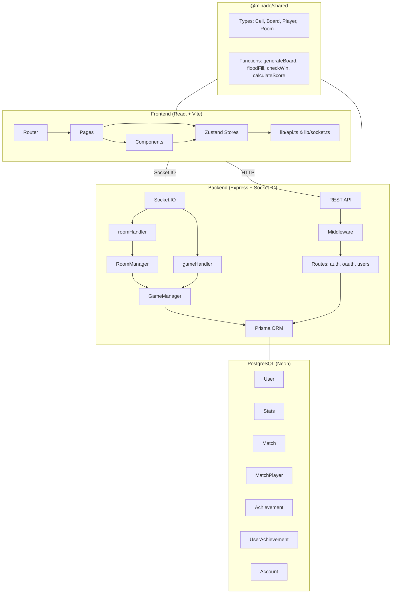
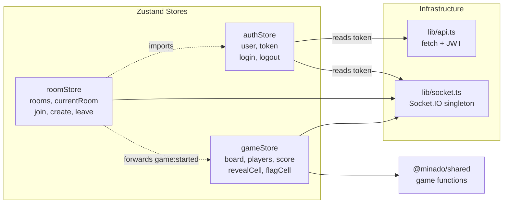
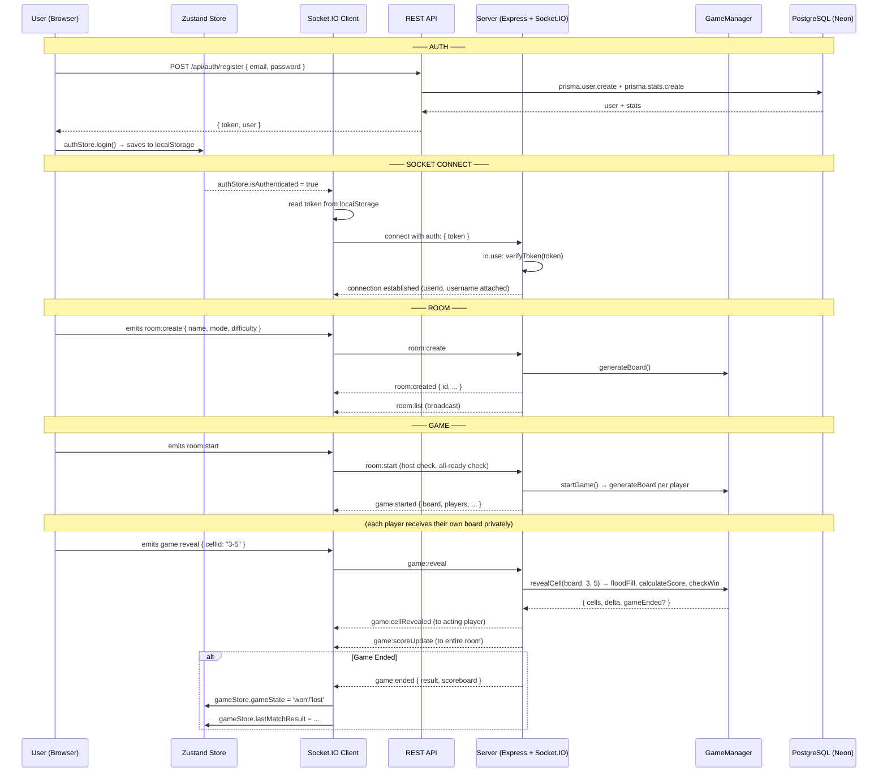
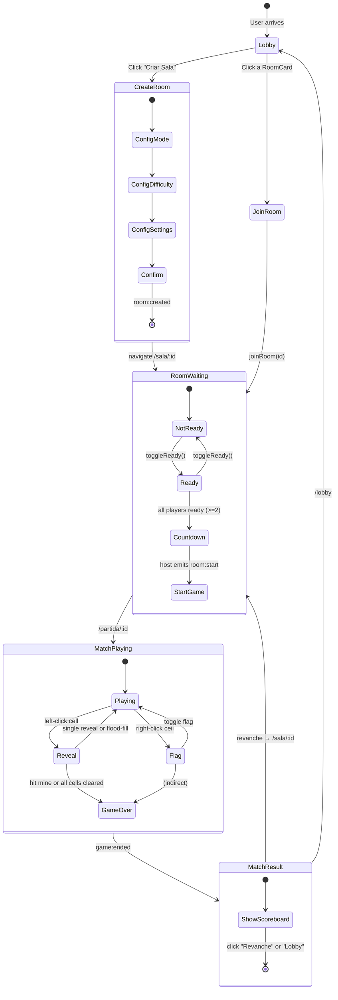

# Minado.gg — Architecture Guide

> **Multiplayer Minesweeper** — a real-time social game built as a monorepo with React + Vite (frontend), Express + Socket.IO (backend), and PostgreSQL via Prisma.

---

## Table of Contents

1. [Overview](#1-overview)
2. [Monorepo Structure](#2-monorepo-structure)
3. [Technology Stack](#3-technology-stack)
4. [Directory Map](#4-directory-map)
5. [Shared Package — `@minado/shared`](#5-shared-package---minadoshared)
6. [Frontend Architecture](#6-frontend-architecture)
7. [Backend Architecture](#7-backend-architecture)
8. [Communication](#8-communication)
9. [Main Flows](#9-main-flows)
10. [Data Model](#10-data-model)
11. [Game Logic](#11-game-logic)

---

## 1. Overview



Minado.gg is a **real-time multiplayer Minesweeper** with 5 game modes. The server is **fully authoritative** — all game logic runs server-side; the client only sends clicks and renders state updates.

---

## 2. Monorepo Structure

The project uses **npm workspaces** with three packages:

```
minado-gg/
├── apps/
│   ├── web/          # @minado/web    — React + Vite frontend
│   └── server/       # @minado/server — Express + Socket.IO backend
└── packages/
    └── shared/       # @minado/shared — Types + pure game functions
```

Workspace configuration in root `package.json`:

```json
{
  "workspaces": ["apps/*", "packages/*"]
}
```

Packages are linked via `file:` protocol:

```json
// apps/web/package.json & apps/server/package.json
"@minado/shared": "file:../../packages/shared"
```

---

## 3. Technology Stack

### Frontend

| Technology | Version | Purpose |
|-----------|---------|---------|
| React | ^19.1 | UI framework |
| TypeScript | ~5.8 | Type safety |
| Vite | ^6.3 | Bundler & dev server |
| React Router | ^7.6 | Client-side routing |
| Zustand | ^5.0 | State management |
| Socket.IO Client | ^4.8 | Real-time communication |
| Tailwind CSS | ^4.1 | Utility-first CSS |
| ESLint | ^9 | Linting |

### Backend

| Technology | Version | Purpose |
|-----------|---------|---------|
| Node.js | 20+ | Runtime |
| Express | ^5.1 | HTTP framework |
| Socket.IO | ^4.8 | WebSocket server |
| TypeScript | ~5.8 | Type safety |
| Prisma | ^7.9 | ORM |
| PostgreSQL (Neon) | — | Database |
| jsonwebtoken | ^9.3 | JWT auth |
| bcryptjs | ^3.0 | Password hashing |
| Passport.js | ^0.7 | OAuth strategies (Google, Discord, GitHub) |
| tsx | ^4.19 | Dev runner |

### Shared (zero dependencies)

| File | Purpose |
|------|---------|
| `packages/shared/src/index.ts` | All types + pure game functions (177 lines) |

---

## 4. Directory Map

```
minado-gg/
│
├── package.json                     # Monorepo root (npm workspaces)
├── README.md                        # Project overview
├── DESIGN.md                        # Design system spec (935 lines)
├── Plano_Implementacao_Minado.gg.md # Implementation plan (PT-BR)
├── Ideias_Campo_Minado_Multiplayer.md # Concept document (PT-BR)
│
├── apps/web/                        # ─── FRONTEND ───
│   ├── vite.config.ts               # Vite + React + Tailwind plugins
│   ├── tsconfig.app.json            # Strict TS, path alias @/ -> src/
│   ├── index.html
│   └── src/
│       ├── main.tsx                 # Entry: BrowserRouter > App
│       ├── App.tsx                  # Routes + SocketManager + ScrollToTop
│       ├── index.css                # Tailwind v4 + design tokens + dark mode
│       │
│       ├── components/
│       │   ├── ui/                  # Atomic design system (10 cmp)
│       │   │   ├── index.ts
│       │   │   ├── Alert.tsx
│       │   │   ├── Avatar.tsx
│       │   │   ├── Badge.tsx
│       │   │   ├── Button.tsx
│       │   │   ├── Card.tsx
│       │   │   ├── Input.tsx
│       │   │   ├── Label.tsx
│       │   │   ├── Modal.tsx
│       │   │   ├── Switch.tsx
│       │   │   └── Tabs.tsx
│       │   ├── blocks/              # Composite blocks (8 cmp)
│       │   │   ├── index.ts
│       │   │   ├── ChatPanel.tsx
│       │   │   ├── GameModeCard.tsx
│       │   │   ├── Leaderboard.tsx
│       │   │   ├── MatchCard.tsx
│       │   │   ├── Navbar.tsx
│       │   │   ├── PlayerRoster.tsx
│       │   │   ├── ProfileCard.tsx
│       │   │   └── RoomCard.tsx
│       │   ├── game/                # Game-specific (7 cmp)
│       │   │   ├── index.ts
│       │   │   ├── Banner.tsx
│       │   │   ├── Board.tsx
│       │   │   ├── Cell.tsx
│       │   │   ├── FxBoom.tsx
│       │   │   ├── FxConfetti.tsx
│       │   │   ├── Mascote.tsx
│       │   │   └── PingRow.tsx
│       │   ├── ThemeProvider.tsx
│       │   ├── theme-context.ts
│       │   └── useTheme.ts
│       │
│       ├── pages/                   # 12 route pages
│       │   ├── HomePage.tsx         #   /  (landing)
│       │   ├── LoginPage.tsx        #   /login
│       │   ├── LobbyPage.tsx        #   /lobby
│       │   ├── CreateRoomPage.tsx   #   /lobby/criar-sala
│       │   ├── RoomPage.tsx         #   /sala/:id
│       │   ├── MatchPage.tsx        #   /partida/:id
│       │   ├── ResultPage.tsx       #   /partida/:id/resultado
│       │   ├── RankingPage.tsx      #   /ranking
│       │   ├── ProfilePage.tsx      #   /perfil/:username
│       │   ├── EditProfilePage.tsx  #   /perfil/editar
│       │   ├── Styleguide.tsx       #   /styleguide
│       │   └── NotFoundPage.tsx     #   *  (404)
│       │
│       ├── store/                   # Zustand state management
│       │   ├── authStore.ts         # Auth state + persist (localStorage)
│       │   ├── roomStore.ts         # Rooms + lobby state
│       │   └── gameStore.ts         # Board + game state + effects
│       │
│       ├── lib/
│       │   ├── api.ts               # fetch wrapper (token from localStorage)
│       │   └── socket.ts            # Socket.IO singleton
│       │
│       └── styles/
│           └── game.css             # Board, mascot, FX animations
│
├── apps/server/                     # ─── BACKEND ───
│   ├── .env                         # DATABASE_URL (Neon), JWT_SECRET, PORT, CLIENT_ORIGIN
│   ├── tsconfig.json
│   ├── prisma.config.ts
│   ├── prisma/
│   │   └── schema.prisma            # 7 models
│   └── src/
│       ├── index.ts                 # Express + Socket.IO bootstrap
│       ├── db/
│       │   └── prisma.ts            # Prisma client singleton
│       ├── game/
│       │   └── GameManager.ts       # Authoritative game logic
│       ├── rooms/
│       │   └── RoomManager.ts       # Room CRUD + lifecycle
│       ├── sockets/
│       │   ├── roomHandler.ts       # room:create/join/leave/ready/start/list
│       │   └── gameHandler.ts       # game:reveal/flag/ping
│       ├── routes/
│       │   ├── auth.ts              # Register, login, GET/PUT /me
│       │   ├── oauth.ts             # Google, Discord, GitHub OAuth
│       │   └── users.ts             # Ranking + profile
│       ├── middleware/
│       │   └── auth.ts              # JWT sign/verify + Express middleware
│       └── generated/prisma/        # Auto-generated Prisma client
│
└── packages/shared/                 # ─── SHARED ───
    ├── package.json                 # @minado/shared (zero deps)
    └── src/
        └── index.ts                 # Types + generateBoard + floodFill + checkWin + calculateScore
```

---

## 5. Shared Package — `@minado/shared`

The **contract layer** between frontend and backend. Zero dependencies, pure TypeScript, consumed directly as `.ts` files (no build step).

### Types

| Type | Description |
|------|-------------|
| `GameMode` | `'competitive' \| 'multi-board' \| 'cooperative' \| 'battle-royale' \| 'fog-of-war'` |
| `Difficulty` | `'easy' \| 'medium' \| 'hard' \| 'expert'` |
| `BoardConfig` | `{ rows, cols, mines }` |
| `Cell` | `{ id, row, col, hasMine, isRevealed, isFlagged, adjacentMines, revealedBy? }` |
| `Board` | `Cell[][]` |
| `Player` | `{ id, username, avatarUrl?, score, isReady, isHost, isConnected? }` |
| `Room` | `{ id, hostId, mode, isPrivate, maxPlayers, status, players, boardConfig, difficulty }` |
| `MatchResult` | `{ matchId, mode, winner?, scoreboard, startedAt, endedAt }` |

### Pure Functions

| Function | Purpose | Used by |
|----------|---------|---------|
| `generateBoard(rows, cols, mines, safeRow?, safeCol?)` | Generates a `Board` with randomly placed mines and adjacency counts. Accepts optional safe coordinates for first-click guarantee (avoids 3×3 zone). | Backend on game start; frontend for offline mode |
| `floodFill(board, row, col)` | DFS-based auto-reveal: reveals all contiguous empty cells plus their numbered borders. Returns list of revealed coordinates. | Backend on cell click |
| `checkWin(board)` | Returns `true` when all non-mine cells are revealed. | Backend after every move |
| `calculateScore(action)` | Maps action → points. See table below. | Backend for score calculation |
| `cloneBoard(board)` | Deep-shallow copy of a board (each cell is a new object, primitives are copied). | Backend for per-player board isolation |

### Scoring Table

| Action | Points |
|--------|--------|
| `reveal` (single numbered cell) | +10 |
| `flood-fill` (>5 cells revealed) | +30 |
| `flag-correct` (flag on a mine) | +25 |
| `flag-wrong` (flag on empty cell) | −15 |
| `explode` (hit a mine) | −50 |
| `win` (clear all cells) | +200 |

### Difficulty Presets

| Difficulty | Rows | Cols | Mines |
|-----------|------|------|-------|
| easy | 9 | 9 | 10 |
| medium | 16 | 16 | 40 |
| hard | 16 | 30 | 99 |
| expert | 24 | 30 | 150 |

---

## 6. Frontend Architecture

### 6.1 Routing

Routes are defined in `App.tsx` with React Router v7:

```
<ThemeProvider>                      // wraps everything
  <SocketManager />                  // socket lifecycle tied to auth
  <ScrollToTop />
  <Routes>
    /styleguide       → Styleguide   // outside catch-all
    /*                                // catch-all wrapper
      /               → HomePage
      /login          → LoginPage
      /lobby          → LobbyPage
      /lobby/criar-sala → CreateRoomPage
      /sala/:id       → RoomPage
      /partida/:id    → MatchPage
      /partida/:id/resultado → ResultPage
      /ranking        → RankingPage
      /perfil/:username → ProfilePage
      /perfil/editar  → EditProfilePage
      *               → NotFoundPage
```

### 6.2 State Management — Zustand Stores



**authStore** (persisted to localStorage key `minado-auth`):
- `user`, `token`, `isAuthenticated`, `isLoading`
- Actions: `login`, `register`, `loginWithOAuth`, `fetchMe`, `logout`

**roomStore**:
- `rooms[]`, `currentRoom`, `isLoading`, `error`, `isConnected`
- Actions: `fetchRooms`, `createRoom`, `joinRoom`, `leaveRoom`, `toggleReady`, `startGame`
- Handles socket events: `room:list`, `room:state`, `room:playerJoined`, `room:playerLeft`, `game:started`

**gameStore** (the largest at ~425 lines):
- `board`, `boardConfig`, `gameState` (idle/playing/won/lost), `players[]`, `messages[]`, `timeElapsed`, `flagsPlaced`, `firstClick`, FX flags, `lastMatchResult`
- Actions: `initBoard`, `revealCell`, `flagCell`, `tick`, `resetGame`
- Handles socket events: `game:started`, `game:cellRevealed`, `game:cellFlagged`, `game:scoreUpdate`, `game:ended`, `chat:message`
- **Offline mode**: if `isOnline === false`, calls `@minado/shared` functions directly

### 6.3 Component Hierarchy

```
App
├── ThemeProvider (ThemeContext)
├── SocketManager (reads auth, manages socket lifecycle)
├── ScrollToTop
└── Routes
    ├── [Page] → Navbar + Page-specific components
    │
    ├── Components/ui (atomic)
    │   ├── Button (5 variants, loading state)
    │   ├── Input (forwardRef, error state)
    │   ├── Label
    │   ├── Badge (6 variants)
    │   ├── Avatar (2 variants, 3 sizes)
    │   ├── Card (3 variants, Header, Title, Content)
    │   ├── Modal (native <dialog>)
    │   ├── Tabs (Context-based, TabList/Trigger/Content)
    │   ├── Switch (role="switch" pattern)
    │   └── Alert (4 variants)
    │
    ├── Components/blocks (composite)
    │   ├── Navbar (sticky, auth-aware)
    │   ├── PlayerRoster (ready/disconnect badges)
    │   ├── ChatPanel (scrollable, auto-scroll)
    │   ├── RoomCard (mode/difficulty/privacy badges)
    │   ├── GameModeCard (+ ModeGrid layout)
    │   ├── Leaderboard (ranked list)
    │   ├── ProfileCard (stats display)
    │   └── MatchCard (VS-style team display)
    │
    └── Components/game
        ├── Board (CSS grid, dynamic columns)
        ├── Cell (mine/flag/number states)
        ├── Banner (win/lose gradient)
        ├── Mascote (SVG bomb, happy/exploded states)
        ├── FxBoom (radial explosion particles)
        ├── FxConfetti (6 falling pieces)
        └── PingRow (quick reactions)
```

### 6.4 Infrastructure Layer

**`lib/api.ts`** — HTTP client:
- Reads JWT from `localStorage` key `minado-auth`
- Prepends `/api` to all paths
- Base URL: `VITE_SERVER_URL || http://localhost:3001`
- Handles errors via thrown exceptions with `data.error` message

**`lib/socket.ts`** — Socket.IO singleton:
- Lazy creation with `autoConnect: false`, transports: `['websocket', 'polling']`
- On `connect_error` with "Token nao fornecido", re-attempts with fresh token
- `connectSocket()` — reads token from localStorage, sets `socket.auth.token`, connects
- `disconnectSocket()` — clean disconnect
- `waitForConnection(timeout=5000)` — Promise-based connection waiter
- `onSocketEvent(event, handler)` — returns cleanup function (React-hook-friendly)

### 6.5 Design System

Defined in `index.css` via Tailwind v4 `@theme` block:

| Token | Values |
|-------|--------|
| **Fonts** | Heading: Baloo 2, Body: Comic Neue |
| **Primary** | Green (10 shades 50–900) |
| **Secondary** | Purple (10 shades) |
| **Accent** | Gold (10 shades) |
| **Radius** | sm: 8px, md: 14px, lg: 22px, xl: 30px |
| **Animation** | fast: 140ms, base: 220ms, slow: 420ms |
| **Easing** | bounce: `0.34,1.56,0.64,1`, standard: `0.22,1,0.36,1` |

Dark mode via `.dark` class on `<html>`, toggled by `ThemeProvider`.

---

## 7. Backend Architecture

### 7.1 Server Entry Point (`src/index.ts`)

```mermaid
graph TB
  ENV[.env: DATABASE_URL, JWT_SECRET, PORT, CLIENT_ORIGIN]

  subgraph Bootstrap
    EX[express()]
    HTTP[createServer http]
    IO[Socket.IO server]
    GM[new GameManager]
    RM[new RoomManager]
  end

  subgraph HTTP_Stack["HTTP Stack"]
    CORS[cors]
    JSON[express.json]
    AR[auth routes<br/>POST register, login<br/>GET/PUT /me]
    OR[oauth routes<br/>POST google, discord, github]
    UR[users routes<br/>GET /ranking, /:username]
    HR[GET /api/health]
  end

  subgraph WS_Stack["Socket.IO Stack"]
    AUTH_MW[io.use: JWT verify]
    RH[roomHandler<br/>create, join, leave, ready, start]
    GH[gameHandler<br/>reveal, flag, ping]
    DC[disconnect → markPlayerDisconnected]
  end

  EX --> HTTP
  IO --> HTTP
  CORS --> JSON
  JSON --> AR
  JSON --> OR
  JSON --> UR
  IO --> AUTH_MW
  AUTH_MW --> RH
  AUTH_MW --> GH
  AUTH_MW --> DC
  RH --> RM
  GH --> GM
  RM -.->|onPlayerRemoved| GM
```

### 7.2 RoomManager (`src/rooms/RoomManager.ts`)

In-memory room state management (no persistence). Core data structures:

```typescript
rooms: Map<string, RoomData>              // roomId → RoomData
socketToRoom: Map<string, string>         // socketId → roomId
playerTimers: Map<string, NodeJS.Timeout> // playerId → disconnect timeout
disconnectedPlayers: Map<string, ...>     // TTL cache (5 min)
```

**Room lifecycle:**

```
NULL → createRoom() → WAITING → startGame() → PLAYING → game end → NULL
                           ↑                     |
                           └── removePlayer() ────┘ (when empty)
```

Key constants:
- `DISCONNECT_TIMEOUT_MS` = 60,000 ms (1 min to reconnect)
- `REMOVED_PLAYER_TTL_MS` = 300,000 ms (5 min cache)

Room ID: 6-character uppercase alphanumeric (e.g. `"A3F8K2"`).

### 7.3 GameManager (`src/game/GameManager.ts`)

Authoritative game state. Holds all active games in memory:

```typescript
interface GameState {
  roomId: string
  config: BoardConfig
  scores: Map<string, GameScoreEntry>
  startedAt: number
  endedAt?: number
  mode: GameMode
  playerBoards: Map<string, PlayerBoardData>
  sharedBoardId?: string
}
```

**Board strategy per game mode:**

| Mode | Per-player board | Notes |
|------|-----------------|-------|
| `competitive` | Identical template (same mines, cloned) | Each player has same layout but independent reveal state |
| `multi-board` | Independent random boards | Each player gets a different mine layout |
| `cooperative` | Single shared board | All players share the exact same board |
| `battle-royale` | (inherits competitive logic) | — |
| `fog-of-war` | (inherits competitive logic) | — |

**`revealCell` algorithm:**
1. Validate existence and state
2. If mine → mark exploded, score −50, return `{ exploded: true }`
3. If `adjacentMines === 0` → run `floodFill`, score +30 if >5 cells, else +10
4. If `adjacentMines > 0` → reveal single cell, score +10
5. Run `checkWin` → if win, score +200, return `{ gameEnded: true }`

### 7.4 REST API Summary

| Method | Path | Auth | Purpose |
|--------|------|------|---------|
| POST | `/api/auth/register` | No | Create account (username + email + password) |
| POST | `/api/auth/login` | No | Authenticate (email + password) → JWT |
| POST | `/api/auth/oauth/google` | No | Google OAuth login |
| POST | `/api/auth/oauth/discord` | No | Discord OAuth login |
| POST | `/api/auth/oauth/github` | No | GitHub OAuth login |
| GET | `/api/auth/me` | Yes | Current user profile + stats |
| PUT | `/api/auth/me` | Yes | Update email/password/avatar |
| GET | `/api/users/ranking` | No | Top 100 by XP |
| GET | `/api/users/:username` | No | Public profile + achievements |
| GET | `/api/health` | No | Health check |

### 7.5 Socket.IO Event Contract

#### Client → Server

| Event | Payload | Handled by |
|-------|---------|------------|
| `room:create` | `{ name, mode, difficulty, isPrivate, password?, maxPlayers, boardConfig? }` | roomHandler |
| `room:join` | `{ roomId, username? }` | roomHandler |
| `room:leave` | — | roomHandler |
| `room:ready` | `{ ready }` | roomHandler |
| `room:start` | — | roomHandler |
| `room:list` | — | roomHandler |
| `chat:message` | `{ text }` | roomHandler |
| `game:reveal` | `{ cellId: "row-col" }` | gameHandler |
| `game:flag` | `{ cellId: "row-col" }` | gameHandler |
| `game:ping` | `{ type }` | gameHandler |

#### Server → Client

| Event | Payload | Target | Description |
|-------|---------|--------|-------------|
| `room:created` | `Room` | Creator | Room created |
| `room:state` | `Room` | Room | State changed |
| `room:list` | `Room[]` | All | Public room list |
| `room:playerJoined` | `Player` | Room | Player joined |
| `room:playerLeft` | `{ playerId }` | Room | Player left |
| `game:playerRemoved` | `{ playerId, username }` | Room | Removed during active game |
| `game:removedForInactivity` | `{ reason }` | Sender | Rejoin denied |
| `game:started` | `{ board, boardMeta, players, gameMode }` | Per-player or room | Game begins |
| `game:cellRevealed` | `{ cellId, value, revealedBy, exploded? }` or `{ batch: [...] }` | Per-player or room | Cell(s) revealed |
| `game:cellFlagged` | `{ cellId, playerId, flagged }` | Per-player or room | Cell flagged |
| `game:scoreUpdate` | `{ playerId, delta, total }` | Room | Score changed |
| `game:ended` | `{ result, scoreboard }` | Room | Game over |
| `game:ping` | `{ playerId, type }` | Room | Ping relay |
| `chat:message` | `{ id, fromId, from, text, ts }` | Room | Chat |
| `error` | `{ code, message }` | Sender | Error |

**Emission scope logic** (`emitToTarget`):
- **Cooperative mode** → emits to entire room (everyone sees everything)
- **All other modes** → emits only to the acting socket (private board)
- Exception: `game:scoreUpdate` and `game:ended` always broadcast to the entire room

---

## 8. Communication



### 8.1 Auth Flow (Socket.IO)

The client reads the JWT from `localStorage` (key `minado-auth`, path `state.token`) and sends it:

1. Socket connects with `socket.auth.token = <JWT>`
2. Server `io.use()` middleware calls `verifyToken(token)`
3. On success: attaches `socket.userId` and `socket.username`, calls `next()`
4. On failure: calls `next(new Error("Token nao fornecido"))`, connection rejected

If the client gets a `connect_error` with "Token nao fornecido", it re-reads the token from localStorage and retries.

### 8.2 Auth Flow (REST)

1. Client POSTs to `/api/auth/login` (or register, or OAuth)
2. Server validates credentials, signs a JWT with `{ userId, username }` (expires 7 days)
3. Client receives `{ token, user }`, stores in Zustand (auto-persisted to localStorage)
4. For protected routes, client sends `Authorization: Bearer <token>`
5. `authMiddleware` extracts and verifies the token, sets `req.user`

---

## 9. Main Flows

### 9.1 Full Game Match Flow



### 9.2 Scoreboard Emission Detail

When a cell action happens, the server emits to **different targets** depending on the data:

```
game:cellRevealed  ──→ acting socket only (in competitive modes)
game:cellRevealed  ──→ entire room (in cooperative)
game:scoreUpdate   ──→ entire room (always — scores are shared)
game:cellFlagged   ──→ acting socket only
game:ended         ──→ entire room (always)
```

This means players can see each other's scores in real-time but cannot see each other's boards (except in cooperative mode).

### 9.3 Disconnect / Reconnect

```
Socket disconnect
    │
    ▼
roomManager.markPlayerDisconnected(socketId)
    │
    ├── isConnected = false
    ├── Start 60s timer
    │
    ├── Player reconnects (same user, new socket)
    │   └── room:join → rejoinRoom() → cancel timer
    │       ├── isConnected = true
    │       └── If game active: re-emit game:started with current board
    │
    └── 60s expires
        └── roomManager.removePlayer()
            ├── gameManager.removePlayerBoard()
            ├── Broadcast room:playerLeft / game:playerRemoved
            └── If room empty → delete room
```

---

## 10. Data Model

```mermaid
erDiagram
    User {
        string id PK
        string username UK
        string email UK
        string avatarUrl "nullable"
        string password "nullable (OAuth users)"
        int xp "default 0"
        int level "default 1"
        datetime createdAt
    }

    Account {
        string id PK
        string userId FK
        string provider "google | discord | github"
        string providerId
        string accessToken "nullable"
        string refreshToken "nullable"
    }

    Stats {
        string id PK
        string userId FK UK
        int victories "default 0"
        int defeats "default 0"
        int matchesPlayed "default 0"
        int currentStreak "default 0"
        int maxStreak "default 0"
        int rank "default 0"
    }

    Match {
        string id PK
        string mode
        int boardRows
        int boardCols
        int mineCount
        string status "default 'playing'"
        datetime startedAt
        datetime endedAt "nullable"
    }

    MatchPlayer {
        string id PK
        string matchId FK
        string userId FK
        int score "default 0"
        boolean exploded "default false"
        int rank "nullable"
        json actions "nullable"
    }

    Achievement {
        string id PK
        string title
        string description
        string condition
    }

    UserAchievement {
        string userId FK
        string achievementId FK
        datetime unlockedAt
    }

    User ||--o{ Account : "has many"
    User ||--o| Stats : "has one"
    User ||--o{ MatchPlayer : "plays"
    User ||--o{ UserAchievement : "earns"
    Achievement ||--o{ UserAchievement : "unlocked by"
    Match ||--o{ MatchPlayer : "includes"
```

**Important note**: The `Match` and `MatchPlayer` tables are defined in the schema but are **not actively written to** yet — game results are broadcast via Socket.IO but not persisted to the database.

---

## 11. Game Logic

### 11.1 Board Generation (`generateBoard`)

```
Input: rows, cols, mineCount, safeRow?, safeCol?

1. INIT: Create rows×cols grid of Cell objects
   - Each cell has id = "{row}-{col}"
   - hasMine = false, isRevealed = false, isFlagged = false, adjacentMines = 0

2. PLACE MINES: Rejection sampling loop (mineCount iterations)
   - Pick random (r, c) within bounds
   - Skip if cell already has a mine
   - Skip if within 3×3 safe zone (Math.abs(r - safeRow) <= 1 && Math.abs(c - safeCol) <= 1)
   - Set cell.hasMine = true

3. CALCULATE ADJACENCY: For each non-mine cell
   - Check all 8 Moore neighbors with bounds checking
   - Count how many have hasMine === true
   - Store in cell.adjacentMines

Return: fully initialized Board
```

### 11.2 Flood Fill (`floodFill`)

```
Input: board, startRow, startCol

DFS(board, r, c):
  - Bounds check: if out of [0, rows) × [0, cols) → return
  - If already revealed, is a mine, or is flagged → return
  - Set cell.isRevealed = true
  - Add (r, c) to result list
  - If cell.adjacentMines === 0:
    - Recurse DFS into all 8 neighbors

Return: Array of { row, col } for all newly revealed cells
```

This implements the classic Minesweeper auto-reveal: empty cells cascade, numbered cells act as boundaries.

### 11.3 Win Check (`checkWin`)

```
For every cell in the board:
  If cell.hasMine === false AND cell.isRevealed === false:
    Return false
Return true
```

### 11.4 Game Modes

| Mode | Board Strategy | Description |
|------|---------------|-------------|
| **competitive** | Same mine layout (cloned), independent reveals | Classic: who clears fastest / scores highest |
| **multi-board** | Independent random boards | Players race on different layouts |
| **cooperative** | Single shared board | Everyone sees the same board, works together |
| **battle-royale** | Same as competitive | Last player standing wins |
| **fog-of-war** | Same as competitive | Limited visibility area |

---

## Quick Reference

| Aspect | Frontend | Backend | Shared |
|--------|----------|---------|--------|
| **Language** | TypeScript + React | TypeScript + Node | TypeScript |
| **State** | Zustand (3 stores) | In-memory Maps | — |
| **Real-time** | Socket.IO Client (singleton) | Socket.IO Server | — |
| **API calls** | `lib/api.ts` (fetch) | Express 5 routes | — |
| **Game logic** | Offline fallback only | Authoritative (source of truth) | Pure functions |
| **Auth** | JWT in localStorage | JWT + bcrypt + OAuth | — |
| **Database** | — | Prisma 7 → PostgreSQL (Neon) | — |
| **CSS** | Tailwind v4 + CSS vars | — | — |
| **Build tool** | Vite 6 | tsx (dev) / tsc (prod) | None (consumed as .ts) |
| **Port** | 3000 (dev) | 3001 | — |
