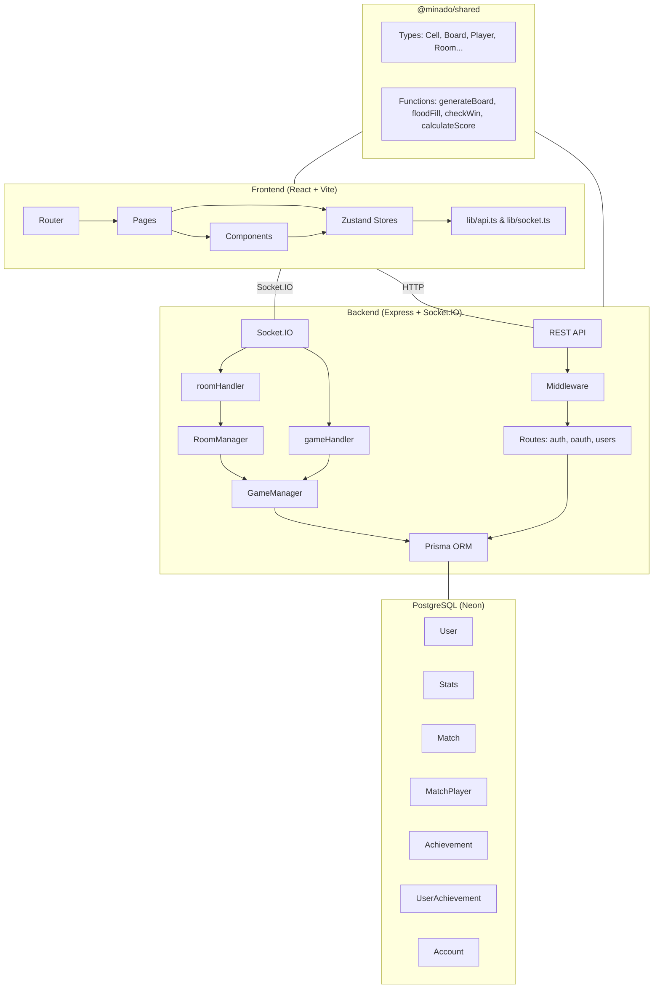
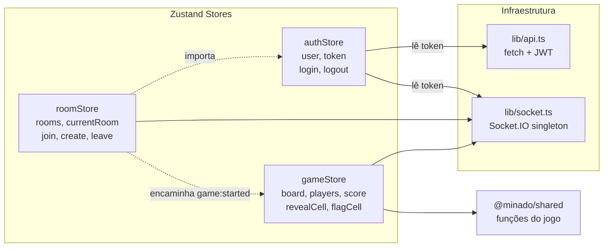
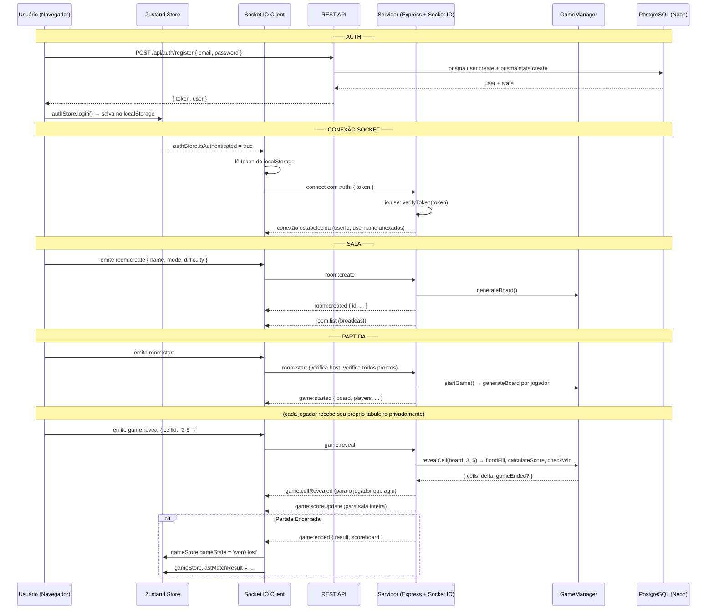
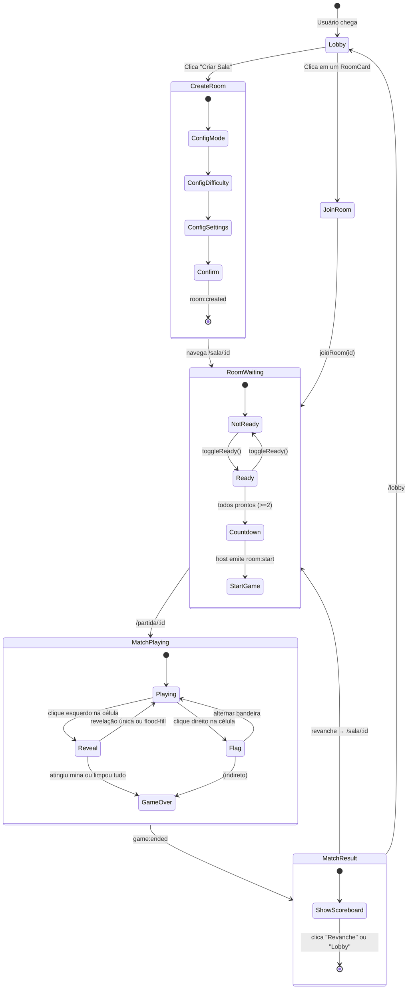

# Minado.gg — Guia de Arquitetura

> **Campo Minado Multiplayer** — um jogo social em tempo real construído como monorepo com React + Vite (frontend), Express + Socket.IO (backend) e PostgreSQL via Prisma.

---

## Sumário

1. [Visão Geral](#1-visão-geral)
2. [Estrutura do Monorepo](#2-estrutura-do-monorepo)
3. [Tecnologias](#3-tecnologias)
4. [Mapa de Diretórios](#4-mapa-de-diretórios)
5. [Pacote Compartilhado — `@minado/shared`](#5-pacote-compartilhado---minadoshared)
6. [Arquitetura do Frontend](#6-arquitetura-do-frontend)
7. [Arquitetura do Backend](#7-arquitetura-do-backend)
8. [Comunicação](#8-comunicação)
9. [Fluxos Principais](#9-fluxos-principais)
10. [Modelo de Dados](#10-modelo-de-dados)
11. [Lógica do Jogo](#11-lógica-do-jogo)

---

## 1. Visão Geral



Minado.gg é um **Campo Minado multiplayer em tempo real** com 5 modos de jogo. O servidor é **totalmente autoritativo** — toda a lógica do jogo roda no servidor; o cliente apenas envia cliques e renderiza atualizações de estado.

---

## 2. Estrutura do Monorepo

O projeto usa **npm workspaces** com três pacotes:

```
minado-gg/
├── apps/
│   ├── web/          # @minado/web    — Frontend React + Vite
│   └── server/       # @minado/server — Backend Express + Socket.IO
└── packages/
    └── shared/       # @minado/shared — Tipos + funções puras do jogo
```

Configuração de workspaces no `package.json` raiz:

```json
{
  "workspaces": ["apps/*", "packages/*"]
}
```

Pacotes são linkados via protocolo `file:`:

```json
// apps/web/package.json & apps/server/package.json
"@minado/shared": "file:../../packages/shared"
```

---

## 3. Tecnologias

### Frontend

| Tecnologia | Versão | Propósito |
|-----------|--------|-----------|
| React | ^19.1 | Framework de UI |
| TypeScript | ~5.8 | Tipagem estática |
| Vite | ^6.3 | Bundler e servidor de dev |
| React Router | ^7.6 | Roteamento client-side |
| Zustand | ^5.0 | Gerenciamento de estado |
| Socket.IO Client | ^4.8 | Comunicação em tempo real |
| Tailwind CSS | ^4.1 | CSS utilitário |
| ESLint | ^9 | Linting |

### Backend

| Tecnologia | Versão | Propósito |
|-----------|--------|-----------|
| Node.js | 20+ | Runtime |
| Express | ^5.1 | Framework HTTP |
| Socket.IO | ^4.8 | Servidor WebSocket |
| TypeScript | ~5.8 | Tipagem estática |
| Prisma | ^7.9 | ORM |
| PostgreSQL (Neon) | — | Banco de dados |
| jsonwebtoken | ^9.3 | Autenticação JWT |
| bcryptjs | ^3.0 | Hash de senhas |
| Passport.js | ^0.7 | Estratégias OAuth (Google, Discord, GitHub) |
| tsx | ^4.19 | Runner de desenvolvimento |

### Compartilhado (zero dependências)

| Arquivo | Propósito |
|---------|-----------|
| `packages/shared/src/index.ts` | Todos os tipos + funções puras do jogo (177 linhas) |

---

## 4. Mapa de Diretórios

```
minado-gg/
│
├── package.json                     # Raiz do monorepo (npm workspaces)
├── README.md                        # Visão geral do projeto
├── DESIGN.md                        # Especificação do design system (935 linhas)
├── Plano_Implementacao_Minado.gg.md # Plano de implementação (PT-BR)
├── Ideias_Campo_Minado_Multiplayer.md # Documento conceitual (PT-BR)
│
├── apps/web/                        # ─── FRONTEND ───
│   ├── vite.config.ts               # Plugins Vite + React + Tailwind
│   ├── tsconfig.app.json            # TS estrito, alias @/ -> src/
│   ├── index.html
│   └── src/
│       ├── main.tsx                 # Entrada: BrowserRouter > App
│       ├── App.tsx                  # Rotas + SocketManager + ScrollToTop
│       ├── index.css                # Tailwind v4 + tokens de design + modo escuro
│       │
│       ├── components/
│       │   ├── ui/                  # Sistema de design atômico (10 cmp)
│       │   │   ├── index.ts
│       │   │   ├── Alert.tsx
│       │   │   ├── Avatar.tsx
│       │   │   ├── Badge.tsx
│       │   │   ├── Button.tsx
│       │   │   ├── Card.tsx
│       │   │   ├── Input.tsx
│       │   │   ├── Label.tsx
│       │   │   ├── Modal.tsx
│       │   │   ├── Switch.tsx
│       │   │   └── Tabs.tsx
│       │   ├── blocks/              # Blocos compostos (8 cmp)
│       │   │   ├── index.ts
│       │   │   ├── ChatPanel.tsx
│       │   │   ├── GameModeCard.tsx
│       │   │   ├── Leaderboard.tsx
│       │   │   ├── MatchCard.tsx
│       │   │   ├── Navbar.tsx
│       │   │   ├── PlayerRoster.tsx
│       │   │   ├── ProfileCard.tsx
│       │   │   └── RoomCard.tsx
│       │   ├── game/                # Específicos do jogo (7 cmp)
│       │   │   ├── index.ts
│       │   │   ├── Banner.tsx
│       │   │   ├── Board.tsx
│       │   │   ├── Cell.tsx
│       │   │   ├── FxBoom.tsx
│       │   │   ├── FxConfetti.tsx
│       │   │   ├── Mascote.tsx
│       │   │   └── PingRow.tsx
│       │   ├── ThemeProvider.tsx
│       │   ├── theme-context.ts
│       │   └── useTheme.ts
│       │
│       ├── pages/                   # 12 páginas de rotas
│       │   ├── HomePage.tsx         #   /  (landing)
│       │   ├── LoginPage.tsx        #   /login
│       │   ├── LobbyPage.tsx        #   /lobby
│       │   ├── CreateRoomPage.tsx   #   /lobby/criar-sala
│       │   ├── RoomPage.tsx         #   /sala/:id
│       │   ├── MatchPage.tsx        #   /partida/:id
│       │   ├── ResultPage.tsx       #   /partida/:id/resultado
│       │   ├── RankingPage.tsx      #   /ranking
│       │   ├── ProfilePage.tsx      #   /perfil/:username
│       │   ├── EditProfilePage.tsx  #   /perfil/editar
│       │   ├── Styleguide.tsx       #   /styleguide
│       │   └── NotFoundPage.tsx     #   *  (404)
│       │
│       ├── store/                   # Gerenciamento de estado (Zustand)
│       │   ├── authStore.ts         # Estado de auth + persist (localStorage)
│       │   ├── roomStore.ts         # Estado de salas + lobby
│       │   └── gameStore.ts         # Tabuleiro + estado do jogo + efeitos
│       │
│       ├── lib/
│       │   ├── api.ts               # Wrapper fetch (token do localStorage)
│       │   └── socket.ts            # Singleton Socket.IO
│       │
│       └── styles/
│           └── game.css             # Tabuleiro, mascote, animações FX
│
├── apps/server/                     # ─── BACKEND ───
│   ├── .env                         # DATABASE_URL (Neon), JWT_SECRET, PORT, CLIENT_ORIGIN
│   ├── tsconfig.json
│   ├── prisma.config.ts
│   ├── prisma/
│   │   └── schema.prisma            # 7 modelos
│   └── src/
│       ├── index.ts                 # Bootstrap Express + Socket.IO
│       ├── db/
│       │   └── prisma.ts            # Singleton do Prisma client
│       ├── game/
│       │   └── GameManager.ts       # Lógica autoritativa do jogo
│       ├── rooms/
│       │   └── RoomManager.ts       # CRUD de salas + ciclo de vida
│       ├── sockets/
│       │   ├── roomHandler.ts       # room:create/join/leave/ready/start/list
│       │   └── gameHandler.ts       # game:reveal/flag/ping
│       ├── routes/
│       │   ├── auth.ts              # Register, login, GET/PUT /me
│       │   ├── oauth.ts             # OAuth Google, Discord, GitHub
│       │   └── users.ts             # Ranking + perfil
│       ├── middleware/
│       │   └── auth.ts              # JWT sign/verify + middleware Express
│       └── generated/prisma/        # Prisma client auto-gerado
│
└── packages/shared/                 # ─── COMPARTILHADO ───
    ├── package.json                 # @minado/shared (zero deps)
    └── src/
        └── index.ts                 # Tipos + generateBoard + floodFill + checkWin + calculateScore
```

---

## 5. Pacote Compartilhado — `@minado/shared`

A **camada de contrato** entre frontend e backend. Zero dependências, TypeScript puro, consumido diretamente como arquivos `.ts` (sem etapa de build).

### Tipos

| Tipo | Descrição |
|------|-----------|
| `GameMode` | `'competitive' \| 'multi-board' \| 'cooperative' \| 'battle-royale' \| 'fog-of-war'` |
| `Difficulty` | `'easy' \| 'medium' \| 'hard' \| 'expert'` |
| `BoardConfig` | `{ rows, cols, mines }` |
| `Cell` | `{ id, row, col, hasMine, isRevealed, isFlagged, adjacentMines, revealedBy? }` |
| `Board` | `Cell[][]` |
| `Player` | `{ id, username, avatarUrl?, score, isReady, isHost, isConnected? }` |
| `Room` | `{ id, hostId, mode, isPrivate, maxPlayers, status, players, boardConfig, difficulty }` |
| `MatchResult` | `{ matchId, mode, winner?, scoreboard, startedAt, endedAt }` |

### Funções Puras

| Função | Propósito | Usado por |
|--------|-----------|-----------|
| `generateBoard(rows, cols, mines, safeRow?, safeCol?)` | Gera um `Board` com minas posicionadas aleatoriamente e contagem de adjacência. Aceita coordenadas seguras opcionais para garantia do primeiro clique (evita zona 3×3). | Backend ao iniciar partida; frontend para modo offline |
| `floodFill(board, row, col)` | Auto-revelação baseada em DFS: revela todas as células vazias contíguas mais suas bordas numeradas. Retorna lista de coordenadas reveladas. | Backend ao clicar em célula |
| `checkWin(board)` | Retorna `true` quando todas as células sem mina estão reveladas. | Backend após cada jogada |
| `calculateScore(action)` | Mapeia ação → pontos. Veja tabela abaixo. | Backend para cálculo de pontuação |
| `cloneBoard(board)` | Cópia profunda-rasa de um tabuleiro (cada célula é um novo objeto, primitivos são copiados). | Backend para isolamento de tabuleiro por jogador |

### Tabela de Pontuação

| Ação | Pontos |
|------|--------|
| `reveal` (célula numerada única) | +10 |
| `flood-fill` (>5 células reveladas) | +30 |
| `flag-correct` (bandeira em mina) | +25 |
| `flag-wrong` (bandeira em célula vazia) | −15 |
| `explode` (atingiu uma mina) | −50 |
| `win` (limpou todas as células) | +200 |

### Presets de Dificuldade

| Dificuldade | Linhas | Colunas | Minas |
|------------|--------|---------|-------|
| easy | 9 | 9 | 10 |
| medium | 16 | 16 | 40 |
| hard | 16 | 30 | 99 |
| expert | 24 | 30 | 150 |

---

## 6. Arquitetura do Frontend

### 6.1 Roteamento

As rotas são definidas em `App.tsx` com React Router v7:

```
<ThemeProvider>                      // envolve tudo
  <SocketManager />                  // ciclo de vida do socket atrelado ao auth
  <ScrollToTop />
  <Routes>
    /styleguide       → Styleguide   // fora do catch-all
    /*                                // wrapper catch-all
      /               → HomePage
      /login          → LoginPage
      /lobby          → LobbyPage
      /lobby/criar-sala → CreateRoomPage
      /sala/:id       → RoomPage
      /partida/:id    → MatchPage
      /partida/:id/resultado → ResultPage
      /ranking        → RankingPage
      /perfil/:username → ProfilePage
      /perfil/editar  → EditProfilePage
      *               → NotFoundPage
```

### 6.2 Gerenciamento de Estado — Stores Zustand



**authStore** (persistida no localStorage chave `minado-auth`):
- `user`, `token`, `isAuthenticated`, `isLoading`
- Ações: `login`, `register`, `loginWithOAuth`, `fetchMe`, `logout`

**roomStore**:
- `rooms[]`, `currentRoom`, `isLoading`, `error`, `isConnected`
- Ações: `fetchRooms`, `createRoom`, `joinRoom`, `leaveRoom`, `toggleReady`, `startGame`
- Escuta eventos: `room:list`, `room:state`, `room:playerJoined`, `room:playerLeft`, `game:started`

**gameStore** (a maior, ~425 linhas):
- `board`, `boardConfig`, `gameState` (idle/playing/won/lost), `players[]`, `messages[]`, `timeElapsed`, `flagsPlaced`, `firstClick`, flags de FX, `lastMatchResult`
- Ações: `initBoard`, `revealCell`, `flagCell`, `tick`, `resetGame`
- Escuta eventos: `game:started`, `game:cellRevealed`, `game:cellFlagged`, `game:scoreUpdate`, `game:ended`, `chat:message`
- **Modo offline**: se `isOnline === false`, chama funções do `@minado/shared` diretamente

### 6.3 Hierarquia de Componentes

```
App
├── ThemeProvider (ThemeContext)
├── SocketManager (lê auth, gerencia ciclo de vida do socket)
├── ScrollToTop
└── Routes
    ├── [Page] → Navbar + componentes específicos da página
    │
    ├── Components/ui (atômicos)
    │   ├── Button (5 variantes, estado loading)
    │   ├── Input (forwardRef, estado de erro)
    │   ├── Label
    │   ├── Badge (6 variantes)
    │   ├── Avatar (2 variantes, 3 tamanhos)
    │   ├── Card (3 variantes, Header, Title, Content)
    │   ├── Modal (native <dialog>)
    │   ├── Tabs (baseado em Context, TabList/Trigger/Content)
    │   ├── Switch (padrão role="switch")
    │   └── Alert (4 variantes)
    │
    ├── Components/blocks (compostos)
    │   ├── Navbar (fixo, consciente de auth)
    │   ├── PlayerRoster (badges de pronto/desconectado)
    │   ├── ChatPanel (scrollável, auto-scroll)
    │   ├── RoomCard (badges de modo/dificuldade/privacidade)
    │   ├── GameModeCard (+ layout ModeGrid)
    │   ├── Leaderboard (lista ranqueada)
    │   ├── ProfileCard (exibição de estatísticas)
    │   └── MatchCard (exibição de times estilo VS)
    │
    └── Components/game
        ├── Board (CSS grid, colunas dinâmicas)
        ├── Cell (estados mina/bandeira/número)
        ├── Banner (gradiente vitória/derrota)
        ├── Mascote (SVG bomba, estados feliz/explodido)
        ├── FxBoom (partículas de explosão radial)
        ├── FxConfetti (6 peças caindo)
        └── PingRow (reações rápidas)
```

### 6.4 Camada de Infraestrutura

**`lib/api.ts`** — Cliente HTTP:
- Lê JWT do `localStorage` chave `minado-auth`
- Prefixa `/api` em todos os caminhos
- URL base: `VITE_SERVER_URL || http://localhost:3001`
- Trata erros via exceções com mensagem `data.error`

**`lib/socket.ts`** — Singleton Socket.IO:
- Criação lazy com `autoConnect: false`, transports: `['websocket', 'polling']`
- Em `connect_error` com "Token nao fornecido", tenta novamente com token fresco
- `connectSocket()` — lê token do localStorage, define `socket.auth.token`, conecta
- `disconnectSocket()` — desconexão limpa
- `waitForConnection(timeout=5000)` — waiter de conexão baseado em Promise
- `onSocketEvent(event, handler)` — retorna função de cleanup (amigável para hooks React)

### 6.5 Design System

Definido em `index.css` via bloco `@theme` do Tailwind v4:

| Token | Valores |
|-------|---------|
| **Fontes** | Título: Baloo 2, Corpo: Comic Neue |
| **Primária** | Verde (10 tons 50–900) |
| **Secundária** | Roxo (10 tons) |
| **Destaque** | Dourado (10 tons) |
| **Raio** | sm: 8px, md: 14px, lg: 22px, xl: 30px |
| **Animação** | rápido: 140ms, base: 220ms, lento: 420ms |
| **Easing** | bounce: `0.34,1.56,0.64,1`, padrão: `0.22,1,0.36,1` |

Modo escuro via classe `.dark` no `<html>`, alternado por `ThemeProvider`.

---

## 7. Arquitetura do Backend

### 7.1 Ponto de Entrada do Servidor (`src/index.ts`)

```mermaid
graph TB
  ENV[.env: DATABASE_URL, JWT_SECRET, PORT, CLIENT_ORIGIN]

  subgraph Bootstrap
    EX[express()]
    HTTP[createServer http]
    IO[Socket.IO server]
    GM[new GameManager]
    RM[new RoomManager]
  end

  subgraph HTTP_Stack["Pilha HTTP"]
    CORS[cors]
    JSON[express.json]
    AR[rotas auth<br/>POST register, login<br/>GET/PUT /me]
    OR[rotas oauth<br/>POST google, discord, github]
    UR[rotas users<br/>GET /ranking, /:username]
    HR[GET /api/health]
  end

  subgraph WS_Stack["Pilha Socket.IO"]
    AUTH_MW[io.use: verificar JWT]
    RH[roomHandler<br/>create, join, leave, ready, start]
    GH[gameHandler<br/>reveal, flag, ping]
    DC[disconnect → markPlayerDisconnected]
  end

  EX --> HTTP
  IO --> HTTP
  CORS --> JSON
  JSON --> AR
  JSON --> OR
  JSON --> UR
  IO --> AUTH_MW
  AUTH_MW --> RH
  AUTH_MW --> GH
  AUTH_MW --> DC
  RH --> RM
  GH --> GM
  RM -.->|onPlayerRemoved| GM
```

### 7.2 RoomManager (`src/rooms/RoomManager.ts`)

Gerenciamento de estado de salas em memória (sem persistência). Estruturas de dados principais:

```typescript
rooms: Map<string, RoomData>              // roomId → RoomData
socketToRoom: Map<string, string>         // socketId → roomId
playerTimers: Map<string, NodeJS.Timeout> // playerId → timeout de desconexão
disconnectedPlayers: Map<string, ...>     // cache TTL (5 min)
```

**Ciclo de vida da sala:**

```
NULL → createRoom() → WAITING → startGame() → PLAYING → fim do jogo → NULL
                           ↑                     |
                           └── removePlayer() ────┘ (quando vazia)
```

Constantes principais:
- `DISCONNECT_TIMEOUT_MS` = 60.000 ms (1 min para reconectar)
- `REMOVED_PLAYER_TTL_MS` = 300.000 ms (cache de 5 min)

ID da sala: 6 caracteres alfanuméricos maiúsculos (ex.: `"A3F8K2"`).

### 7.3 GameManager (`src/game/GameManager.ts`)

Estado autoritativo do jogo. Mantém todos os jogos ativos em memória:

```typescript
interface GameState {
  roomId: string
  config: BoardConfig
  scores: Map<string, GameScoreEntry>
  startedAt: number
  endedAt?: number
  mode: GameMode
  playerBoards: Map<string, PlayerBoardData>
  sharedBoardId?: string
}
```

**Estratégia de tabuleiro por modo de jogo:**

| Modo | Tabuleiro por jogador | Notas |
|------|----------------------|-------|
| `competitive` | Modelo idêntico (mesmas minas, clonado) | Cada jogador tem mesmo layout mas estado de revelação independente |
| `multi-board` | Tabuleiros aleatórios independentes | Cada jogador recebe um layout diferente de minas |
| `cooperative` | Único tabuleiro compartilhado | Todos os jogadores compartilham o exato mesmo tabuleiro |
| `battle-royale` | (herda lógica competitive) | — |
| `fog-of-war` | (herda lógica competitive) | — |

**Algoritmo `revealCell`:**
1. Validar existência e estado
2. Se mina → marcar como explodido, pontuação −50, retornar `{ exploded: true }`
3. Se `adjacentMines === 0` → executar `floodFill`, pontuação +30 se >5 células, senão +10
4. Se `adjacentMines > 0` → revelar célula única, pontuação +10
5. Executar `checkWin` → se vitória, pontuação +200, retornar `{ gameEnded: true }`

### 7.4 Resumo da API REST

| Método | Caminho | Auth | Propósito |
|--------|---------|------|-----------|
| POST | `/api/auth/register` | Não | Criar conta (username + email + password) |
| POST | `/api/auth/login` | Não | Autenticar (email + password) → JWT |
| POST | `/api/auth/oauth/google` | Não | Login OAuth Google |
| POST | `/api/auth/oauth/discord` | Não | Login OAuth Discord |
| POST | `/api/auth/oauth/github` | Não | Login OAuth GitHub |
| GET | `/api/auth/me` | Sim | Perfil do usuário atual + estatísticas |
| PUT | `/api/auth/me` | Sim | Atualizar email/senha/avatar |
| GET | `/api/users/ranking` | Não | Top 100 por XP |
| GET | `/api/users/:username` | Não | Perfil público + conquistas |
| GET | `/api/health` | Não | Health check |

### 7.5 Contrato de Eventos Socket.IO

#### Cliente → Servidor

| Evento | Payload | Manipulado por |
|--------|---------|----------------|
| `room:create` | `{ name, mode, difficulty, isPrivate, password?, maxPlayers, boardConfig? }` | roomHandler |
| `room:join` | `{ roomId, username? }` | roomHandler |
| `room:leave` | — | roomHandler |
| `room:ready` | `{ ready }` | roomHandler |
| `room:start` | — | roomHandler |
| `room:list` | — | roomHandler |
| `chat:message` | `{ text }` | roomHandler |
| `game:reveal` | `{ cellId: "linha-coluna" }` | gameHandler |
| `game:flag` | `{ cellId: "linha-coluna" }` | gameHandler |
| `game:ping` | `{ type }` | gameHandler |

#### Servidor → Cliente

| Evento | Payload | Alvo | Descrição |
|--------|---------|------|-----------|
| `room:created` | `Room` | Criador | Sala criada |
| `room:state` | `Room` | Sala | Estado mudou |
| `room:list` | `Room[]` | Todos | Lista de salas públicas |
| `room:playerJoined` | `Player` | Sala | Jogador entrou |
| `room:playerLeft` | `{ playerId }` | Sala | Jogador saiu |
| `game:playerRemoved` | `{ playerId, username }` | Sala | Removido durante jogo ativo |
| `game:removedForInactivity` | `{ reason }` | Remetente | Reentrada negada |
| `game:started` | `{ board, boardMeta, players, gameMode }` | Por jogador ou sala | Partida começou |
| `game:cellRevealed` | `{ cellId, value, revealedBy, exploded? }` ou `{ batch: [...] }` | Por jogador ou sala | Célula(s) revelada(s) |
| `game:cellFlagged` | `{ cellId, playerId, flagged }` | Por jogador ou sala | Célula marcada |
| `game:scoreUpdate` | `{ playerId, delta, total }` | Sala | Pontuação mudou |
| `game:ended` | `{ result, scoreboard }` | Sala | Partida encerrada |
| `game:ping` | `{ playerId, type }` | Sala | Repetidor de ping |
| `chat:message` | `{ id, fromId, from, text, ts }` | Sala | Mensagem de chat |
| `error` | `{ code, message }` | Remetente | Erro |

**Lógica de escopo de emissão** (`emitToTarget`):
- **Modo cooperativo** → emite para sala inteira (todos veem tudo)
- **Todos os outros modos** → emite apenas para o socket que agiu (tabuleiro privado)
- Exceção: `game:scoreUpdate` e `game:ended` sempre transmitem para a sala inteira

---

## 8. Comunicação



### 8.1 Fluxo de Auth (Socket.IO)

O cliente lê o JWT do `localStorage` (chave `minado-auth`, caminho `state.token`) e o envia:

1. Socket conecta com `socket.auth.token = <JWT>`
2. Middleware `io.use()` do servidor chama `verifyToken(token)`
3. Em caso de sucesso: anexa `socket.userId` e `socket.username`, chama `next()`
4. Em caso de falha: chama `next(new Error("Token nao fornecido"))`, conexão rejeitada

Se o cliente receber um `connect_error` com "Token nao fornecido", ele relê o token do localStorage e tenta novamente.

### 8.2 Fluxo de Auth (REST)

1. Cliente faz POST para `/api/auth/login` (ou register, ou OAuth)
2. Servidor valida credenciais, assina um JWT com `{ userId, username }` (expira em 7 dias)
3. Cliente recebe `{ token, user }`, armazena no Zustand (auto-persistido no localStorage)
4. Para rotas protegidas, cliente envia `Authorization: Bearer <token>`
5. `authMiddleware` extrai e verifica o token, define `req.user`

---

## 9. Fluxos Principais

### 9.1 Fluxo Completo de uma Partida



### 9.2 Detalhamento de Emissão de Pontuação

Quando uma ação de célula acontece, o servidor emite para **alvos diferentes** dependendo dos dados:

```
game:cellRevealed  ──→ apenas o socket que agiu (em modos competitivos)
game:cellRevealed  ──→ sala inteira (no cooperativo)
game:scoreUpdate   ──→ sala inteira (sempre — pontuações são compartilhadas)
game:cellFlagged   ──→ apenas o socket que agiu
game:ended         ──→ sala inteira (sempre)
```

Isso significa que jogadores podem ver as pontuações uns dos outros em tempo real, mas não podem ver os tabuleiros alheios (exceto no modo cooperativo).

### 9.3 Desconexão / Reconexão

```
Socket desconecta
    │
    ▼
roomManager.markPlayerDisconnected(socketId)
    │
    ├── isConnected = false
    ├── Inicia timer de 60s
    │
    ├── Jogador reconecta (mesmo usuário, novo socket)
    │   └── room:join → rejoinRoom() → cancela timer
    │       ├── isConnected = true
    │       └── Se jogo ativo: re-emite game:started com tabuleiro atual
    │
    └── 60s expiram
        └── roomManager.removePlayer()
            ├── gameManager.removePlayerBoard()
            ├── Broadcast room:playerLeft / game:playerRemoved
            └── Se sala vazia → deleta sala
```

---

## 10. Modelo de Dados

```mermaid
erDiagram
    User {
        string id PK
        string username UK
        string email UK
        string avatarUrl "nullable"
        string password "nullable (usuários OAuth)"
        int xp "default 0"
        int level "default 1"
        datetime createdAt
    }

    Account {
        string id PK
        string userId FK
        string provider "google | discord | github"
        string providerId
        string accessToken "nullable"
        string refreshToken "nullable"
    }

    Stats {
        string id PK
        string userId FK UK
        int victories "default 0"
        int defeats "default 0"
        int matchesPlayed "default 0"
        int currentStreak "default 0"
        int maxStreak "default 0"
        int rank "default 0"
    }

    Match {
        string id PK
        string mode
        int boardRows
        int boardCols
        int mineCount
        string status "default 'playing'"
        datetime startedAt
        datetime endedAt "nullable"
    }

    MatchPlayer {
        string id PK
        string matchId FK
        string userId FK
        int score "default 0"
        boolean exploded "default false"
        int rank "nullable"
        json actions "nullable"
    }

    Achievement {
        string id PK
        string title
        string description
        string condition
    }

    UserAchievement {
        string userId FK
        string achievementId FK
        datetime unlockedAt
    }

    User ||--o{ Account : "tem muitos"
    User ||--o| Stats : "tem um"
    User ||--o{ MatchPlayer : "joga"
    User ||--o{ UserAchievement : "conquista"
    Achievement ||--o{ UserAchievement : "desbloqueada por"
    Match ||--o{ MatchPlayer : "inclui"
```

**Nota importante**: As tabelas `Match` e `MatchPlayer` estão definidas no schema mas **não são escritas ativamente** ainda — os resultados das partidas são transmitidos via Socket.IO mas não persistidos no banco de dados.

---

## 11. Lógica do Jogo

### 11.1 Geração do Tabuleiro (`generateBoard`)

```
Entrada: rows, cols, mineCount, safeRow?, safeCol?

1. INICIALIZAR: Criar grid rows×cols de objetos Cell
   - Cada célula tem id = "{linha}-{coluna}"
   - hasMine = false, isRevealed = false, isFlagged = false, adjacentMines = 0

2. POSICIONAR MINAS: Loop de amostragem por rejeição (mineCount iterações)
   - Escolher (r, c) aleatório dentro dos limites
   - Pular se célula já tem mina
   - Pular se dentro da zona segura 3×3 (Math.abs(r - safeRow) <= 1 && Math.abs(c - safeCol) <= 1)
   - Definir cell.hasMine = true

3. CALCULAR ADJACÊNCIA: Para cada célula sem mina
   - Verificar todas as 8 vizinhanças de Moore com verificação de limites
   - Contar quantas têm hasMine === true
   - Armazenar em cell.adjacentMines

Retornar: Board totalmente inicializado
```

### 11.2 Flood Fill (`floodFill`)

```
Entrada: board, startRow, startCol

DFS(board, r, c):
  - Verificar limites: se fora de [0, rows) × [0, cols) → retornar
  - Se já revelada, é mina, ou está marcada → retornar
  - Definir cell.isRevealed = true
  - Adicionar (r, c) à lista de resultado
  - Se cell.adjacentMines === 0:
    - Recursão DFS em todos os 8 vizinhos

Retornar: Array de { row, col } para todas as células recém-reveladas
```

Isso implementa a auto-revelação clássica do Campo Minado: células vazias em cascata, células numeradas agem como limites.

### 11.3 Verificação de Vitória (`checkWin`)

```
Para cada célula no tabuleiro:
  Se cell.hasMine === false E cell.isRevealed === false:
    Retornar false
Retornar true
```

### 11.4 Modos de Jogo

| Modo | Estratégia de Tabuleiro | Descrição |
|------|------------------------|-----------|
| **competitive** | Mesmo layout de minas (clonado), revelações independentes | Clássico: quem limpa mais rápido / pontua mais alto |
| **multi-board** | Tabuleiros aleatórios independentes | Jogadores competem em layouts diferentes |
| **cooperative** | Único tabuleiro compartilhado | Todos veem o mesmo tabuleiro, trabalham juntos |
| **battle-royale** | Mesmo que competitive | Último jogador de pé vence |
| **fog-of-war** | Mesmo que competitive | Área de visibilidade limitada |

---

## Referência Rápida

| Aspecto | Frontend | Backend | Compartilhado |
|---------|----------|---------|---------------|
| **Linguagem** | TypeScript + React | TypeScript + Node | TypeScript |
| **Estado** | Zustand (3 stores) | Mapas em memória | — |
| **Tempo real** | Socket.IO Client (singleton) | Socket.IO Server | — |
| **Chamadas API** | `lib/api.ts` (fetch) | Rotas Express 5 | — |
| **Lógica do jogo** | Apenas fallback offline | Autoritativa (fonte da verdade) | Funções puras |
| **Auth** | JWT no localStorage | JWT + bcrypt + OAuth | — |
| **Banco de dados** | — | Prisma 7 → PostgreSQL (Neon) | — |
| **CSS** | Tailwind v4 + variáveis CSS | — | — |
| **Ferramenta de build** | Vite 6 | tsx (dev) / tsc (prod) | Nenhuma (consumido como .ts) |
| **Porta** | 3000 (dev) | 3001 | — |
